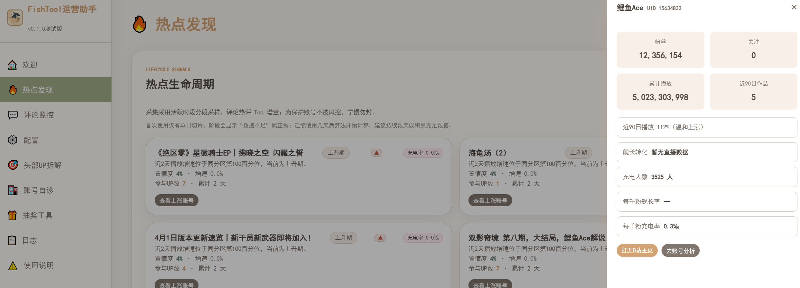

# FishTool - B站个人自媒体运营工具箱

> 版本更新记录见 [CHANGELOG.md](./CHANGELOG.md)

这是一个完全使用Astrbot在手机QQ聊天窗口vibe coding的项目，是为B站UP主打造的智能运营助手，可自由配置LLM API，覆盖**热点发现 → 舆情监控 → 竞品调研 → 账号自诊 → 抽奖真人筛选**完整运营链路。Web 端 + 桌面端双形态，开箱即用。纯Astrbot开发难免有架构问题与设计缺陷，如果您有更好的想法或功能设计，欢迎提出改进，同时如果您具备相关运营领域工作经验，也十分欢迎您能够加入项目提出想法与思路，共同改进，让本项目能够更好地服务于实际业务需求！



## ✨ 功能亮点

### 🔥 热点发现
- **分区热门 Tag 词云**：自动抓取分区热门榜，可视化词云卡片
- **热点生命周期算法**：对热点信号自动判定 出现/上升/稳定/衰退 四阶段并渲染趋势徽标，算法以注册制可插拔
- **活动情报追踪**：官方活动 + UGC 运营号动态双源监控
- **AI 选题助手**：基于真实热点生成创意选题，支持选题库管理

### 💬 评论监控
- **三档智能采集**：快速 / 普通 / 完整，支持增量采集
- **四层去重**：同用户复读折叠 → 跨用户同内容聚合 → SimHash + 编辑距离模糊匹配 → 时间窗热点检测
- **情感分析**：词典规则 + LLM 可选增强
- **舆情预警**：负面突增 / 评论暴涨 / 风险关键词实时监控

### 🎁 抽奖工具
- **目标预览**：视频 / 动态抽奖目标一键接入
- **真人筛选**：反抽奖号识别，区分羊毛党与存量用户
- **随机抽奖**：公平随机 + 中奖名单校验

### 📊 头部拆解
- **分区头部 UP 主**：一键获取分区 TOP 榜单
- **LLM 五维度运营策略分析**：选题方向 / 标题套路 / 封面风格 / 发布节奏 / 互动引导
- **多源数据退化**：三方站点 > B站公开页 > 本地估算，透明标注数据完整性

### 🩺 账号自诊
- **全量数据采集**：粉丝 / 播放 / 互动率 / 投稿节奏
- **Benchmark 对比**：与分区数据对比，计算排名分位
- **报告导出**：Markdown / PDF 格式，含改进建议

### 🖥️ 桌面客户端
- 内嵌 WebView 主窗口 + 系统托盘常驻
- 桌宠悬浮窗：WebSocket 实时通信，待机 / 拖拽 / 点击 / 通知 四态切换
- 评论预警、风控提醒实时弹窗

## 🚀 快速开始

```bash
# 1. 安装依赖
pip install -r requirements.txt

# 2a. 启动 Web 版（浏览器访问 http://localhost:8000）
python start_web.py

# 2b. 或启动桌面版
python start_desktop.py

# 3. 打包 exe（可选，产物在 dist/）
python build.py
```

详细使用教程见 [QUICKSTART.md](QUICKSTART.md)，接口文档启动后访问 `http://localhost:8000/docs`。

## 📁 项目结构

```
bili_ops_toolbox/
├── bilibili/           # B站API封装（WBI签名、Cookie池、限频器）
├── core/               # 核心基础设施（配置、数据库、日志、异常、监控）
├── llm/                # LLM客户端（OpenAI兼容，可自定义端点）
├── modules/
│   ├── hotspot/        # 热点发现（采集、Tag词云、活动追踪、选题生成）
│   │   └── algorithm/  # 热点生命周期算法（注册制可插拔）
│   ├── comment/        # 评论监控（采集、四层去重、情感分析、预警）
│   ├── lottery/        # 抽奖工具（真人筛选、随机抽奖）
│   ├── up_analyzer/    # 头部拆解（数据采集、策略分析）
│   └── self_diagnosis/ # 账号自诊（数据分析、报告生成）
├── web/                # FastAPI 服务
│   ├── main.py         # 主应用
│   ├── routers/        # API 路由（按功能拆分）
│   └── frontend/       # 前端（原生 HTML/CSS/JS，按页拆分）
├── desktop/            # 桌面客户端（WebView 主窗 + 桌宠）
├── tools/              # 运维与开发工具
├── tests/              # pytest 测试
├── config/  logs/  data/  reports/
├── start_web.py        # Web 启动入口
├── start_desktop.py    # 桌面启动入口
└── main.py             # 主程序入口
```

## 💡 技术亮点

1. **完整 WBI 签名**：自动密钥更新，请求重试指数退避
2. **防风控设计**：令牌桶限频 + 429 退避 + 熔断 + Cookie 池多账号轮换
3. **评论去重算法**：SimHash 快速粗筛 + Levenshtein 精确匹配
4. **成本控制**：LLM 批量处理，词典规则优先，无 LLM 配置自动降级
5. **热点生命周期算法**：算法注册制设计，可替换实现（当前 heuristic_v1）
6. **数据安全**：敏感信息 Fernet 加密存储，本地 SQLite
7. **可观测性**：分级日志 + 风控事件追踪 + Token 用量统计

## 🧪 测试

```bash
pytest tests/ -q
```

> 注：热点采集类测试需要联网且 IP 未被风控标记；离线环境请跳过 `test_hotspot_collector.py`、`test_hotspot_tag_cloud.py`。

## ⚠️ 合规声明

1. 本工具仅用于个人账号运营分析，请勿用于恶意爬取或商业滥用
2. 内置严格限频保护，请勿绕过
3. Cookie 等敏感信息加密存储，请妥善保管配置文件
4. B站接口可能随时变更，如遇采集异常请升级至最新版本

## 📄 License

MIT
